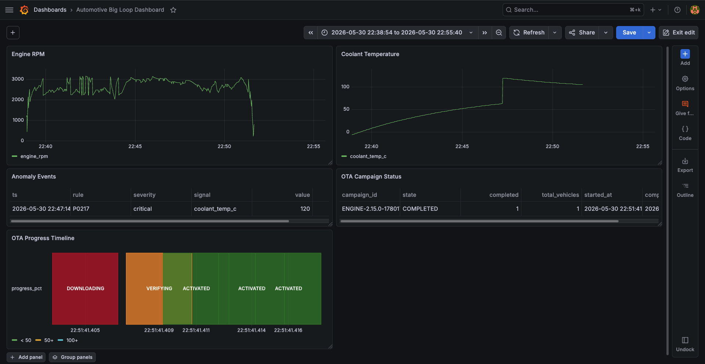

# auto-telemetry-pipeline

> **Real-time vehicle telemetry pipeline with OTA update capability for simulation** — a software-defined vehicle data backbone built with Python, Apache Kafka, MQTT, PostgreSQL and Docker.

This project simulates the data lifecycle of a connected vehicle fleet. Raw CAN bus frames from multiple ECUs are streamed through a Kafka-based pipeline, decoded, analyzed for anomalies, stored for analytics. Additionally, a Mosquitto-based MQTT broker is used to trigger over-the-air update campaigns in between TCU and OTA Server.

---

## Core Logic

**Edge (Veheicle):** 4 ECUs per vehicle, generating raaw CAN 2.0A frames
**Pipe:** Kafka-based stream processing. Decodes raw frames into snapshots and runs a rule-based anomaly engine.
**OTA:** Uptane-inspired rollout logic built with MQTT protocol and SHA-256 verification, canary stages and auto-rollback for a predefined threshold.

---

## Tech Choices
**Redpanda:** Alternative to standard Kafka for local development
**Postgres + Grafana:** Using DirectQuery for real-time monitorung of snapshots and campaigns

---

## Architecture

```
┌─────────────────────────────────────────────────────────────────────┐
│                            VEHICLE (TCU)                            │
│                                                                     │
│  ┌─────────────┐  ┌──────────────┐  ┌──────────┐  ┌─────────────┐   │
│  │  Engine ECU │  │  Trans. ECU  │  │   BMS    │  │  ADAS ECU   │   │
│  │  0x0C0–0CF  │  │  0x120–12F   │  │ 0x310–31F│  │  0x420–42F  │   │
│  └──────┬──────┘  └──────┬───────┘  └────┬─────┘  └──────┬──────┘   │
│         └────────────────┴───────────────┴───────────────┘          │
│                              CAN Bus                                │
│                        (11-bit, CAN 2.0A)                           │
│                                │                                    │
│                         ┌──────▼──────┐                             │
│                         │   Gateway   │  ◄── MQTT: ota/commands     │
│                         │    (TCU)    │  ──► MQTT: ota/status       │
│                         └──────┬──────┘                             │
└────────────────────────────────┼────────────────────────────────────┘
                   ┌─────────────┼──────────────┐
                   │ can-raw                    │
       ┌───────────▼────────────┐   ┌───────────▼────────────┐
       │      Apache Kafka      │   │       Mosquitto        │   
       │       (Redpanda)       │   │         (MQTT)         │
       │                        │   │                        │
       │  can-raw               │   │  ota/commands/#        │
       │  telemetry-processed   │   │  ota/status/#          │
       │  anomaly-events        │   │                        │
       └────────────┬───────────┘   └──────────┬─────────────┘
                    │                          │
            ┌───────▼───────┐        ┌─────────▼─────────┐
            │   Pipeline    │        │    OTA Server     │
            │               │        │                   │
            │ - CAN decode  │        │ - Campaign mgmt   │
            │ - Rule engine │        │ - Canary rollout  │
            │ - Anomaly det.│        │ - Rollback logic  │
            └────────┬──────┘        └───────────────────┘
                     │
            ┌────────▼──────┐
            │  PostgreSQL   │
            └────────┬──────┘
                     │
            ┌────────▼──────┐
            │    Grafana    │
            │ (DirectQuery) │
            └───────────────┘
```

---

## Dashboard



---

## Key Features

**Vehicle simulation**
- 4 ECUs per vehicle: Engine, Transmission, BMS, ADAS
- CAN 2.0A standard frame format (11-bit arbitration IDs, simplified for simulation)
- DBC-style signal definitions — bit-level packing with factor/offset/range
- Physically correlated sensor values: RPM ↔ throttle ↔ engine load ↔ temperatures
- Realistic driving cycle which follows WLTP Class 3b velocity profile
- Sample fault injection: engine overheat (P0217), low oil pressure (P0521), battery drain (P0562), AEB trigger

**Data pipeline**
- Raw CAN frames → decoded signal snapshots up to 100Hz per ECU
- Pipeline aggregates and decodes frames into 1-second telemetry snapshots
- Rule-based anomaly engine (12 rules planned across powertrain, chassis, ADAS)
- Separate Kafka topics for raw frames, processed telemetry, and anomaly events
- Designed for horizontal scaling: each vehicle is an independent producer

**OTA update system**
- Firmware package management with SHA-256 checksum verification
- Uptane-inspired campaign flow: canary → progressive rollout → completion
- Automatic rollback on error rate threshold breach
- Rollout stages: PREPARE → DOWNLOAD → VERIFY → INSTALL → ACTIVATE / ROLLBACK

**Analytics**
- All telemetry and anomaly events persisted to PostgreSQL
- Grafana dashboard via DirectQuery: live signal monitoring, anomaly trends, OTA campaign status, fleet health overview
- Architecture designed for cloud migration, currently Dockerized

---

## CAN Message Catalogue

|  CAN ID  |     Message     |                                         Signals                                              |
|----------|-----------------|----------------------------------------------------------------------------------------------|
|  0x0C0   | ENGINE_STATUS_1 | engine_rpm, throttle_pct, engine_load_pct, ignition_timing                                   |
|  0x0C1   | ENGINE_STATUS_2 | coolant_temp_c, oil_temp_c, oil_pressure_bar, maf_gs, map_kpa                                |
|  0x0C2   | ENGINE_STATUS_3 | fuel_level_pct, fuel_consumption, injector_pw_us, lambda                                     |
|  0x0CF   | ENGINE_FAULT    | mil_status, dtc_count, dtc_p0300, dtc_p0171, dtc_p0217                                       |
|  0x120   | TRANS_STATUS_1  | gear_engaged, input_shaft_rpm, output_shaft_rpm, transmission_torque_nm, shift_in_progress   |
|  0x121   | TRANS_STATUS_2  | shifter_pos, trans_temp_c                                                                    |
|  0x12F   | TRANS_FAULT     | tcm_mil_status, tcm_dtc_count, dtc_p0700, dtc_p0715, dtc_p0730                               |
|  0x310   | BMS_STATUS_1    | pack_voltage_v, pack_current_a, soc_pct, soh_pct                                             |
|  0x311   | BMS_STATUS_2    | cell_temp_min/max_c, cell_v_min/max_mv, balancing_active                                     |
|  0x420   | ADAS_LANE       | lane_departure, road_curvature, lane_offset_m, speed_limit_kmh                               |
|  0x421   | ADAS_COLLISION  | fcw_active, ttc_ms, target_dist_m, target_rel_speed, aeb_triggered                           |

---

## OTA Update Flow

```
OTA Server              MQTT (Mosquitto)               Vehicle (TCU)
    │                           │                           │
    │──────── PREPARE ────────► │ ───────────────────────- ►│
    │                           │                           │ download + SHA-256 verify
    │◄── status: downloading ── │ ◄───────────────────────- │
    │◄─── status: verifying ─── │ ◄───────────────────────- │
    │                           │                           │
    │──────── INSTALL ────────► │ ──────────────────────── ►│
    │◄────── status: done ───── │ ◄───────────────────────- │
    │                           │                           │
    │─────── ACTIVATE ────────► │ ──────────────────────── ►│
    │◄─── status: activated ─── │ ◄───────────────────────- │
    │                           │                           │
    │  (error rate > 15%)       │                           │
    │─────── ROLLBACK ────────► │ ──────────────────────── ►│
    │◄── status: rolled_back ── │ ◄───────────────────────- │
```

---

## Project Structure

```
auto-telemetry-pipeline/
├── vehicle/
│   ├── __init__.py
│   ├── can_bus.py              # DBC-style signal catalogue
│   ├── can_codec.py            # CAN 2.0A bit-level encode/decode
│   ├── tcu.py              # TCU: orchestrates ECUs, Kafka producer, OTA client
│   └── ecu/
│       ├── __init__.py
│       ├── engine_ecu.py       # Powertrain signals + DTC fault injection
│       ├── transmission_ecu.py
│       ├── bms_ecu.py
│       └── adas_ecu.py
├── pipeline/
│   └── processor.py            # CAN decoder, rule-based anomaly engine
├── ota/
│   ├── firmware.py             # Package management, SHA-256, versioning, rollback
│   └── server.py               # Campaign manager, canary rollout, rollback logic
├── proto/
│   ├── can_frame.proto         # Protobuf schema for CAN frame envelope
│   └── ota.proto               # Protobuf schema for OTA updates
├── tests/                      # Test files
│   ├── test_anomaly_rules.py
│   ├── test_can_codec.py
│   └── test_ota_firmware.py
├── config/                     # Configuration files
│   ├── wltp_cycle.csv          # WLTP driving cycle
│   ├── settings.yaml
│   ├── anomaly_rules.yaml
│   └── mosquitto.conf
├── dashboard/                  # PostgreSQL schema
│   ├── schema.sql
├── pytest.ini
├── docker-compose.yml
├── requirements.txt
├── README.md                   # This file
└── main.py                     # Demo entrypoint
```

---

## Getting Started

**Prerequisites:** Docker, Docker Compose, Python 3.11+

```bash
git clone https://github.com/onurizmitlioglu/automotive-big-loop.git
cd automotive-big-loop

# Start Kafka (Redpanda) + PostgreSQL
docker compose up -d

# Install dependencies
pip install -r requirements.txt

# Run the full pipeline (vehicle + pipeline processor + OTA server)
python main.py
```

Connect Grafana to PostgreSQL (`localhost:5432`, database `telemetry`) using DirectQuery to explore live telemetry and anomaly data.
Grafana dashboard available at http://localhost:3000 (default credentials: admin/admin)

---

## Tech Stack

|       Layer        |           Technology             |
|--------------------|----------------------------------|
| Messaging          | Apache Kafka (Redpanda), MQTT    |
| Vehicle simulation | Python — custom CAN 2.0A codec   |
| Stream processing  | Python — Kafka Consumer/Producer |
| Storage            | PostgreSQL                       |
| Visualization      | Grafana (DirectQuery)            |
| Infrastructure     | Docker Compose                   |

---

## Important Note

The CAN simulation currently assumes a noise-free bus which is unrealistic. Real world frame loss is not modeled yet.

---


## Roadmap
- Per-ECU versioning with rollback history
- Transmission, BMS and ADAS ECU signal generation
- Cloud migration (AWS IoT Core + MSK)

---

## License

MIT